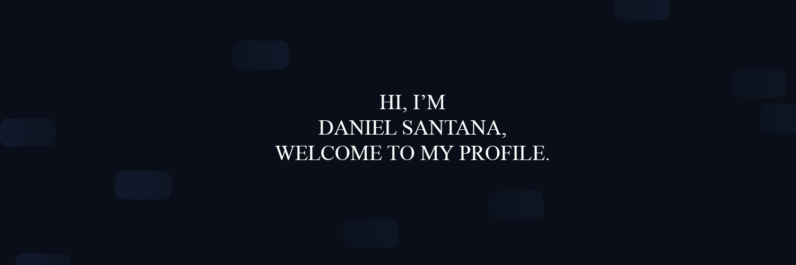

### Hi there 👋

I'm Daniel Santana, a student, future systems analyst and developer. Currently in graduation.

If I helped you in any way, leave a follow up to support me.

  <a href="https://github.com/DanielSantDev">
  
  

 
 
  ##
  

 
  
  
  
  
  

